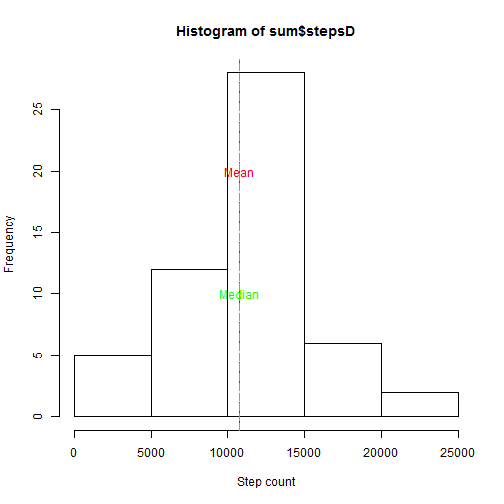
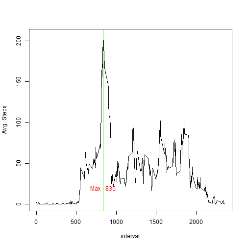
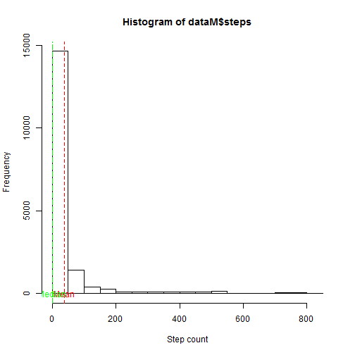
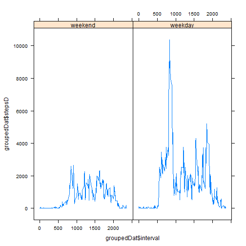

```r
title: "Reproducible Research: Peer Assessment 1"
```

```
## Warning: NAs introduced by coercion
```

```
## Error in title:"Reproducible Research: Peer Assessment 1": NA/NaN argument
```

```r
output: 
  html_document:
    keep_md: true
```

```
## Error in eval(expr, envir, enclos): object 'output' not found
```

```r
## Loading and preprocessing the data
```

```r
data <- read.csv("repdata_data_activity/activity.csv")
data[[2]] <- as.Date(data[[2]])
```

## What is mean total number of steps taken per day?

```r
library(dplyr)
sum <- data %>% group_by(date) %>% filter(!is.na(steps)) %>% summarise(stepsD=sum(steps))#, mean = mean(steps), median=median(steps))
meanMed <- data %>% group_by(date) %>% filter(!is.na(steps)) %>% summarise(mean = mean(steps), median=median(steps))
hist(sum$stepsD, xlab="Step count")
abline(v=mean(sum$stepsD), lty=2, col="red")
abline(v=median(sum$stepsD), lty=5, col="green")
text(mean(sum$stepsD), 20, labels="Mean", col="red")
text(median(sum$stepsD), 10, labels="Median", col="green")
```



```r
summary(sum$stepsD)
```

```
##    Min. 1st Qu.  Median    Mean 3rd Qu.    Max. 
##      41    8841   10765   10766   13294   21194
```

## What is the average daily activity pattern?

```r
mean <- data %>% group_by(interval) %>% filter(!is.na(steps)) %>% summarise(avg = mean(steps))
plot(mean$interval, mean$avg, type="l", xlab="interval", ylab="Avg. Steps" )
abline(v=mean[order(mean$avg,decreasing = T)[1],1], col="green")
text(mean[order(mean$avg,decreasing = T)[1],1], 20, labels=paste("Max", mean[order(mean$avg,decreasing = T)[1],1] , sep=" - "), col="red")
```




## Imputing missing values

```r
dataM <- data 
na_count <-sapply(dataM, function(y) sum(length(which(is.na(y)))))
na_count <- data.frame(na_count)
na_count$observations <-NROW(dataM)
data.frame(na_count)
```

```
##          na_count observations
## steps        2304        17568
## date            0        17568
## interval        0        17568
```

```r
## creating filling NAs in dataset
for(i in 1:nrow(data)){

  if(is.na(data[i,1])){
    dataM[i,1] <- data[data$interval == data[i,3],] %>% dplyr::summarise(mean=mean(steps,  na.rm= TRUE))
  } 

}

hist(dataM$steps, xlab="Step count")
abline(v=mean(dataM$steps), lty=2, col="red")
abline(v=median(dataM$steps), lty=5, col="green")
text(mean(dataM$steps), 20, labels="Mean", col="red")
text(median(dataM$steps), 10, labels="Median", col="green")
```


## Are there differences in activity patterns between weekdays and weekends?

```r
library(lattice) 
weekdays1 <- c('Monday', 'Tuesday', 'Wednesday', 'Thursday', 'Friday')
dataM$wDay <- factor((weekdays(dataM$date) %in% weekdays1), levels=c(FALSE, TRUE), labels=c('weekend', 'weekday'))
groupedDat <- dataM %>% group_by(interval, wDay) %>% summarise(stepsD = sum(steps))
xyplot(groupedDat$stepsD~groupedDat$interval|groupedDat$wDay, type="l")
```


```

